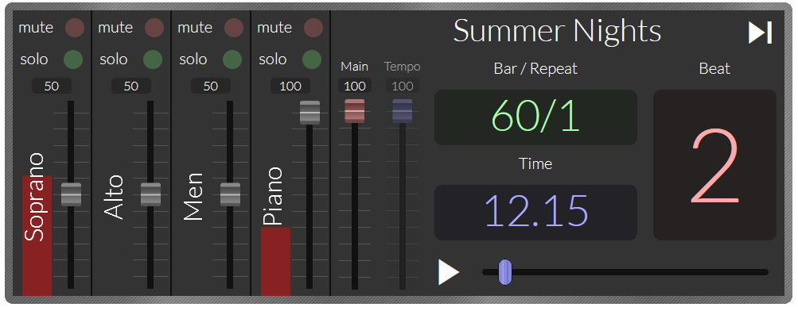
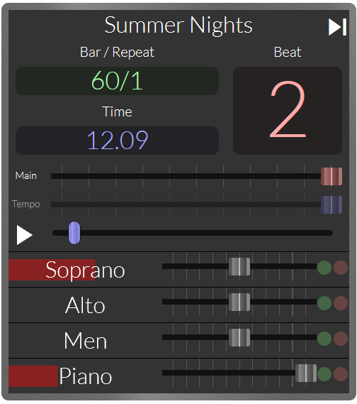

# Choir Practice Webapp

This app is an interface through which members of a choir can access practice versions of performance pieces.  The full size interface looks like this:



The app is reactive and tries to re-arrange itself to fit with the available screen size.  The smallest format, for mobile, looks like ths:



## Aims

- Provide a simple interface which any choir member should be able to easily use to playback, pause and rewind practice parts.
- Be able to adjust the volume of any vocal part or accompanyment
- Be able to track the beat, bar number and repeat count.
- Be able to start from any provided bar number and repeat.
- Be able to play alternate versions of a practice piece, e.g. recorded with different speeds.
- Function on a reasonable range of devices, including laptops, phones and tablets.

## Defining a score

With the present implementation the app must be provided with a 'score' query parameter in the url which points to a JSON file with the filename specified relative to the root of the app.  An example score definition file is below.

```json
{
  "title":"Summer Nights",
  "scores":[
    {
      "subtitle":"",
      "parts":[
        {"name":"Soprano","url":"/summer-nights-8af9de45/sop.mp3","volume":0.5},
        {"name":"Alto","url":"/summer-nights-8af9de45/alto.mp3","volume":0.5},
        {"name":"Men","url":"/summer-nights-8af9de45/men.mp3","volume":0.5},
        {"name":"Piano","url":"/summer-nights-8af9de45/piano.mp3","volume":1}
        ],
      "bars":[
        {"from":54,"tempo":126,"timeSig":4,"beats":16},
        {"repeat":1,"beats":72},
        {"from":58,"repeat":2,"beats":48},
        {"from":76,"beats":96},
        {"timeSig":2,"beats":2},
        {"timeSig":4,"beats":88},
        {"tempo":85,"beats":36},
        {"tempo":70,"beats":2},
        {"tempo":40,"beats":6},
        {"timeSig":2,"beats":2},
        {"timeSig":4,"tempo":60,"beats":4},
        {"tempo":50,"beats":4}
      ]    
    },
    {
      "subtitle":"85%",
      "parts":[
        {"name":"Soprano","url":"/summer-nights-8af9de45/sop.85.mp3","volume":0.5},
        {"name":"Alto","url":"/summer-nights-8af9de45/alto.85.mp3","volume":0.5},
        {"name":"Men","url":"/summer-nights-8af9de45/men.85.mp3","volume":0.5},
        {"name":"Piano","url":"/summer-nights-8af9de45/piano.85.mp3","volume":1}
        ],
      "bars":[
        {"from":54,"tempo":107.1,"timeSig":4,"beats":16},
        {"repeat":1,"beats":72},
        {"from":58,"repeat":2,"beats":48},
        {"from":76,"beats":96},
        {"timeSig":2,"beats":2},
        {"timeSig":4,"beats":88},
        {"tempo":72.25,"beats":36},
        {"tempo":59.5,"beats":2},
        {"tempo":34,"beats":6},
        {"timeSig":2,"beats":2},
        {"timeSig":4,"tempo":51,"beats":4},
        {"tempo":42.5,"beats":4}
      ]    
    }
  ]
}
```
Other than the `title` the only other top-level property is the array of `scores`.  Each score should be variants of the same piece, generally with the same bar count - when a user switches between scores the app tries to go to the same bar in the new variant.

Each score has a `subtitle`, an array of `parts` and a definition of the `bars`.

Each part has a `name` (please check it fits in the space available in the app), a `url` to the file (typically an mp3, must be a format supported by the target browsers), and a default `volume` level (range 0-1.0).

The most complex component are the `bars` definitions.  Each entry has only one mandatory property which is the number of `beats` the entry spans.  All other properties are optional and generally are inherited from previous bars, the exception being the `repeat` count:
- `from` indicates to start counting _from_ the specified bar number.  The beat will be reset to 1.  This is typically used to indicate to jump back due to a repeat, or to jump forward to a second-time bar or a coda.  Sometimes the piece is part of a broader score and it start on a higher bar number.
- `tempo` indicated beats per minute (default to 100).
- `timeSig` indicates beats per bar (default 4, good practice to always specify).
- `repeat` indicates which repeat the passage represents.  Note that `repeat` is the only property not inherited from previous entries, and it defaults to `null`, i.e. to no displaying any indication of repeat.

The piece above has most of the variants you might come across - starting from a bar other than one, one repeat, with 1st and 2nd time bars, some bars with only 2 beats instead of 4 and changes in tempo, particularly towards the end.

## building

This app is built using Vite and Vue3.  To serve a hot-reloading development version:
```bash
npm run dev
```
and to build the app (to the dist folder):
``` bash
npm run build
```

## roadmap

- Have the option of a metronome with a bar of lead-in beats (repurpose the non-working 'tempo' slider for the metronome volume).
- Create a locally-hostable version (most likely an electron app) which can sync to/from an S3 bucket where the app and scores can be hosted and provide simpler means to create and manage scores and play accompanyment during rehearsal.

## A note on changing playback speed
The playback speed of a sound file can easily be changed, unfortunately this also changes the pitch, and correcting that pitch change is not simple.  A few attempts have been made, none of them satisfactory.  The approach taken currently is to store several alternate versions of a score with different speeds.

There are three potential solutions to this.  First the facility to natively fix this in the audio API might become available, after all this is possible through the `<audio>` HTML5 control so the browsers know how to do this.  A second solution might be to find a suitable means of playing either Midi or musescore files natively.  Finally some bright spark might find a way to get the Audio API to do this right - this seems the furthest out as there have definitely been attempts but none have been particularly satisfactory.
